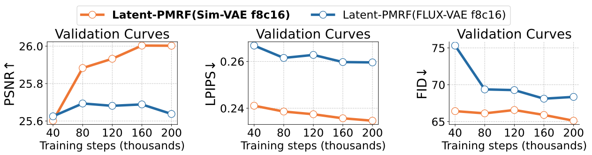

<p align="center">
  
</p>

<p align="center">
  <!-- <a href="https://vectorspacelab.github.io/OmniGen2"></a> -->
  <a href="https://arxiv.org/abs/2507.00447"></a>
  <a href="https://huggingface.co/sienna223/Sim-VAE"></a>
</p>

<h4 align="center">
    <p>
        <a href=#-news>News</a> |
        <a href=#-quick-start>Quick Start</a> |
        <a href=#%EF%B8%8F-citing-us>Citation</a>
    <p>
</h4>

## 🔥 News
- **2025-07-12**: We release **Sim-VAE**, model weights can be accessed in [huggingface](https://huggingface.co/sienna223/Sim-VAE).

## Introduction
**We propose Latent-PMRF, a novel framework for learning latent-generative models tailored for image restoration tasks. The core principle is to achieve minimal distortion under the constraint of optimal perceptual quality.**
Our framework's design is guided by two critical aspects of image restoration:
- **Fidelity**: The formulation of Latent-PMRF ensures that its best achievable fidelity is upper-bounded by the reconstruction capability of its underlying Variational Autoencoder (VAE).
- **Perceptual Quality**: By operating in the VAE's latent space—which is better aligned with human perception than the pixel space—Latent-PMRF not only yields higher visual quality but also achieves a **5.79X** speedup over PMRF in processing time, as demonstrated by superior FID scores.
Recognizing that the VAE's reconstruction ability dictates the upper bound of fidelity, we also introduce **Sim-VAE**. This streamlined VAE architecture is designed for high-fidelity reconstruction and significantly outperforms existing VAEs (e.g., SD-VAE, FLUX-VAE) in both reconstruction and downstream restoration tasks.

<p align="center">
  
  <br>
  <em>Illustration of perception optimization efficiency in latent space.</em>
</p>

<p align="center">
  
  <br>
  <em>Convergence comparison of VAEs.</em>
</p>

<p align="center">
  
  <br>
  <em>Performance comparison of VAEs.</em>
</p>
## 📌 TODO
- [ ] Weights of Latent-PMRF.
- [ ] Training code and guidance of Latent-PMRF.

## 🚀 Quick Start

### 🛠️ Environment Setup

#### ✅ Recommended Setup

```bash
# 1. Clone the repo
git clone git@github.com:Luciennnnnnn/Latent-PMRF.git
cd Latent-PMRF

# 2. (Optional) Create a clean Python environment
conda create -n latent-pmrf python=3.12
conda activate latent-pmrf

# 3. Install dependencies
# 3.1 Install PyTorch (choose correct CUDA version)
pip install torch==2.7.1 torchvision --extra-index-url https://download.pytorch.org/whl/cu126

# 3.2 Install other required packages
pip install -r requirements.txt
```

#### 🌏 For users in Mainland China

```bash
# Install PyTorch from a domestic mirror
pip install torch==2.7.1 torchvision --index-url https://mirror.sjtu.edu.cn/pytorch-wheels/cu126

# Install other dependencies from Tsinghua mirror
pip install -r requirements.txt -i https://pypi.tuna.tsinghua.edu.cn/simple
```

---

### 🧪 Use Sim-VAE

```python
from PIL import Image

import torch
from torchvision.transforms.functional import to_tensor, to_pil_image

from latent_pmrf.models.autoencoders.autoencoder_kl_sim import AutoencoderKLSim


vae = AutoencoderKLSim.from_pretrained("sienna223/Sim-VAE-c32")
vae.to(dtype=torch.float16, device="cuda")

input_image = Image.open("example_images/1.png")
input_image = to_tensor(input_image) * 2 - 1
input_image = input_image.to(device="cuda", dtype=torch.float16)

with torch.no_grad():
    output = vae(input_image.unsqueeze(0), return_dict=False)[0]

output = (output * 0.5 + 0.5).clamp(0, 1)
output_image = to_pil_image(output.squeeze(0))
output_image.save("vae_output.png")
```

## ❤️ Citing Us
If you find this repository or our work useful, please consider giving a star ⭐ and citation 🦖, which would be greatly appreciated:

```bibtex
@article{luo2025latent,
  title={Latent Posterior-Mean Rectified Flow for Higher-Fidelity Perceptual Face Restoration},
  author={Luo, Xin and Zhang, Menglin and Lan, Yunwei and Zhang, Tianyu and Li, Rui and Liu, Chang and Liu, Dong},
  journal={arXiv preprint arXiv:2507.00447},
  year={2025}
}
```
